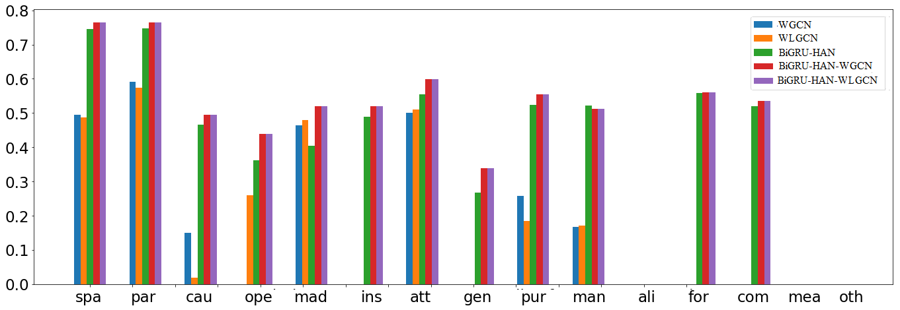

# A Deep Learning based Framework Benefiting from Unique Characteristics of Patents for Semantic Relation Classification
Recently deep learning has become an important method for relation classification in patent texts. However, until now most studies take advantage of the deep learning models just by replacing generic texts with patent texts while ignoring the huge differences between them, which enables the performance of the generic models reduced greatly. To leverage the unique characteristics of patent texts for models improvement, two aspects of work have been done in this study:

- a comprehensive comparison is conducted among 7 annotated corpus from different fields, thus to highlight the unique characteristics of patent texts quantitatively; 
-  a deep learning framework integrating BiGRU-HAN and GCN is proposed to benefit from these characteristics, where the former is responsible for obtaining cues from the sentence where the entity pair is located, and the latter is to collect information from other similar entity pairs for more cues.

The experimental results show that the new framework is capable of benefiting from the unique characteristic of patent texts. Compared to the BiGRU-HAN model alone, it achieves a significant improvement of 3.3% in micro-average F1-value.



# Data
TFH-2020 (Chen et al. 2020) is selected as the empirical study to demonstrate the method. This is an annotated corpus of 1010 patent abstracts pertaining to *thin film head* technology in hard-disk. To describe the elements of the inventions and working mechanisms with structured information, a well-crafted information schema is used for patent annotation containing 17 types of entities and 15 types of semantic relations.  

# Codes
The source codes are in the current main directory.   
    ```
    BiGRU-HAN-GCN
    ├── ...
    ├── demo
    └── code
    	├── tf_metrics                        
        └── model                           # model codes
        	├── __init__.py                    
        	└── inits.py                       
        	└── layers.py                   # GCN layer
        	└── metrics.py                  # evaluation with Pre/Rec/F1
        	└── models.py                   # base model
        	└── network_BiGRU-HAN-GCN.py    # BiGRU-HAN-GCN model
        └── utils            
            ├── __init__.py    
            ├── initial.py     
            ├── plot_pr.py                  # plot evaluation curve
            ├── preprocessData.py           # pre-proprocess Data
            ├── preprocessData.py           # generate Data for training
            └── utils.py                    # basic utilities
    ```

# Requirements
- Python (>=2.7)
- TensorFlow (=1.11)
- scikit-learn (>=0.18)
- Matplotlib (>=2.0.0)
- networkx (=2.2)

# Train
will be updated soon ...

# Test
will be updated soon ...


# Reference
Chen, L., Xu S., Zhu L., Zhang J., Lei X., & Yang G. (2020). A deep learning based method for extracting semantic information from patent documents. Scientometrics, 125(1), 289–312.  
https://github.com/awesome-patent-mining/TFH_Annotated_Dataset  
https://github.com/squirrel1982/TensorFlow-NRE  
https://github.com/tkipf/gcn  